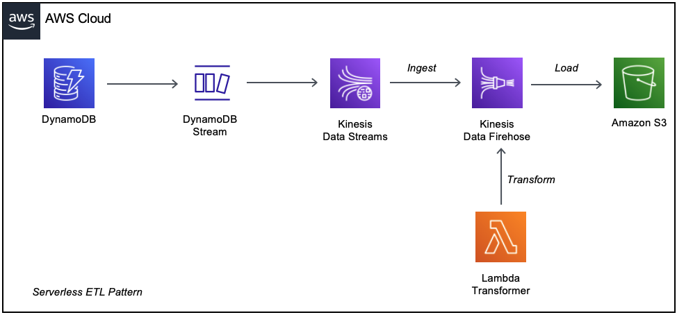

## AWS Serverless Ingest Transform Load (ITL) Pattern
## Kinesis Data Stream - Kinesis Firehose - Lambda - S3

This is a Java implementation of the ETL/ITL Pattern using AWS serverless services.

Reference: https://aws.amazon.com/kinesis/data-firehose/

In this example DynamoDB Stream will send events to Kinesis Data Stream, which will forward them to the Kinesis Firehose.
A Lambda function will transform these messages, return the processed event and finally Kinesis Firehose will load them into an S3 bucket.

This is a fully managed and scalable pattern, you only need to maintain the Lambda function code.

The SAM template contains all the information to deploy AWS resources and also the permission required by these service to communicate.

You will be able to create and delete the CloudFormation stack using the AWS CLI.

This is fully functional example implemented in Java 11.

Important: this application uses various AWS services and there are costs associated with these services after the Free Tier usage - please see the AWS Pricing page for details. You are responsible for any AWS costs incurred.

## Language:
#### This is a Maven project which uses Java 11 and AWS SDK

## Framework

The framework used to deploy the infrastructure is SAM(AWS Serverless Application Model)

## Services used

The AWS services used in this pattern are
#### DynamoDB - DynamoDB Stream - Kinesis Data Stream - Kinesis Data Firehose - Lambda - S3

Topology



## Deployment commands

````
mvn clean package

# create an S3 bucket where the source code will be stored
# the bucket name must be unique globally so feel free to change the bucket name
aws s3 mb s3://tyyiwid97293uodiuidausd

# copy the source code located in the target folder:
aws s3 cp target/sourceCode.zip s3://tyyiwid97293uodiuidausd

# SAM will deploy the CloudFormation stack described in the template.yml file:
sam deploy --s3-bucket tyyiwid97293uodiuidausd --stack-name itl-pattern --capabilities CAPABILITY_IAM

````

## Testing

To test the endpoint first send data using the following command. Be sure to update the endpoint with endpoint of your stack.

```
aws dynamodb put-item --table-name SourceDDBTable --item '{"SensorID": {"S": "SEN200"},"Temp": {"S": "26"}}' --return-consumed-capacity TOTAL
aws dynamodb put-item --table-name SourceDDBTable --item '{"SensorID": {"S": "SEN300"},"Temp": {"S": "29"}}' --return-consumed-capacity TOTAL
aws dynamodb put-item --table-name SourceDDBTable --item '{"SensorID": {"S": "SEN400"},"Temp": {"S": "31"}}' --return-consumed-capacity TOTAL

aws s3 ls s3://deliverybucketibercodekdfow33ew2 --recursive --human-readable --summarize

aws s3 cp s3://deliverybucketibercodekdfow33ew2/COPY_FROM_PREVIOUS_OUTPUT.gz data.gz

gunzip data.gz

cat data
```

## Cleanup

Run the given command to delete the resources that were created. It might take some time for the CloudFormation stack to get deleted.
```
aws s3 rm s3://deliverybucketibercodekdfow33ew2 --recursive

aws cloudformation delete-stack --stack-name itl-pattern

aws s3 rm s3://tyyiwid97293uodiuidausd --recursive

aws s3 rb s3://tyyiwid97293uodiuidausd
```

## Requirements

* [Create an AWS account](https://portal.aws.amazon.com/gp/aws/developer/registration/index.html) if you do not already have one and log in. The IAM user that you use must have sufficient permissions to make necessary AWS service calls and manage AWS resources.
* [AWS CLI](https://docs.aws.amazon.com/cli/latest/userguide/install-cliv2.html) installed and configured
* [Git Installed](https://git-scm.com/book/en/v2/Getting-Started-Installing-Git)
* [AWS Serverless Application Model](https://docs.aws.amazon.com/serverless-application-model/latest/developerguide/serverless-sam-cli-install.html) (AWS SAM) installed


## Author bio
Razvan Minciuna
Software Architect
https://www.linkedin.com/in/razvanminciuna/

